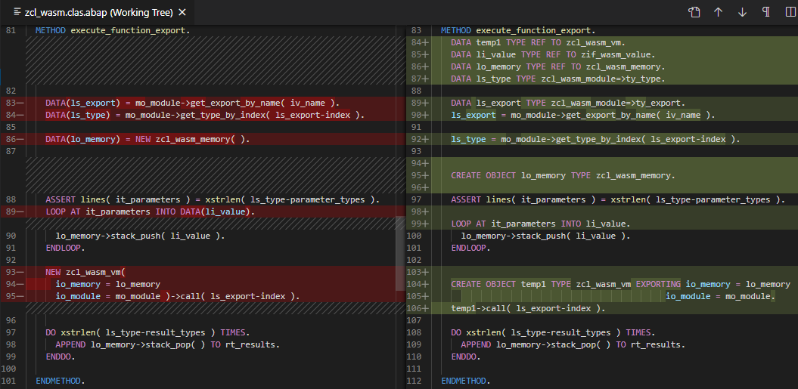
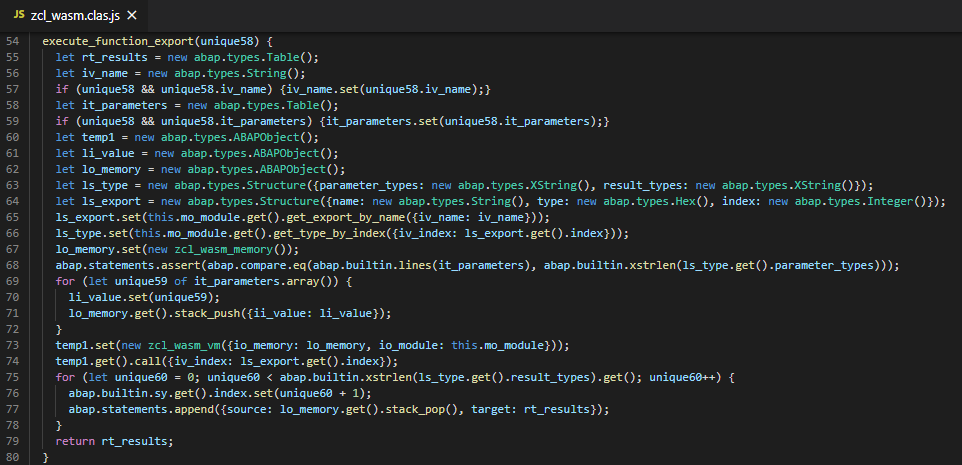

# abap-wasm
Somewhat free interpretation of a very basic [WebAssembly](https://webassembly.github.io/spec/core/) Virtual Machine in ABAP.

* Works on 702 and up, including [Steampunk](https://blogs.sap.com/2019/08/20/its-steampunk-now/)
* Complete Continious Integration(CI) setup

Install via [abapGit](https://abapgit.org)

Usage: see [unit tests in ZCL_WASM](https://github.com/larshp/abap-wasm/blob/master/src/zcl_wasm.clas.testclasses.abap#L16)

## WebAssembly(WASM)
A lot of [awesome](https://github.com/mbasso/awesome-wasm) projects and programming languages can be compiled to WASM. Being able to execute WASM in ABAP would open a large new ecosystem of possibilities on the ABAP stack.

It will probably be slow to execute WASM on the ABAP application server, time will tell.

## Version Support
abap-wasm is developed using some [new ABAP syntax](https://abaplint.app/stats/larshp/abap-wasm/statement_compatibility), in order to still support 702, the source code is automatically downported using the downport functionality in [abaplint](https://abaplint.org). The downport only works for a small subset of the ABAP language so expect problems, but it exists here and now for everyone as open source.

## Complete CI/Unit Test Setup
For every push to this repository, static analysis and unit tests is run.
This means every change is tested in isolation, giving a complete Continious Integration setup the way
it is [supposed to work](https://martinfowler.com/articles/continuousIntegration.html).

Static analysis is performed by [abaplint](https://abaplint.org).

To run unit tests, the downported(702) ABAP code is [transpiled](https://github.com/abaplint/transpiler) to javascript, which then can be run on [GitHub Actions](https://github.com/features/actions). Again, the transpiling is fragile, but works here and now for everyone as open source.

